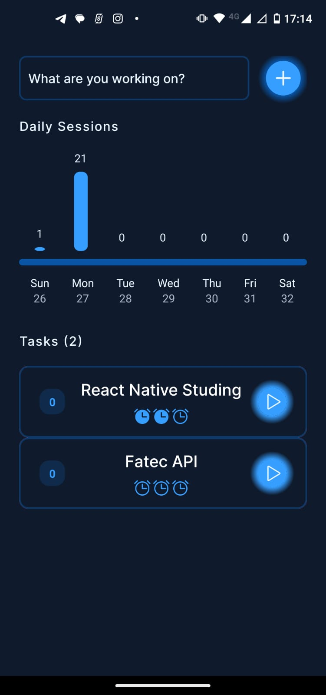
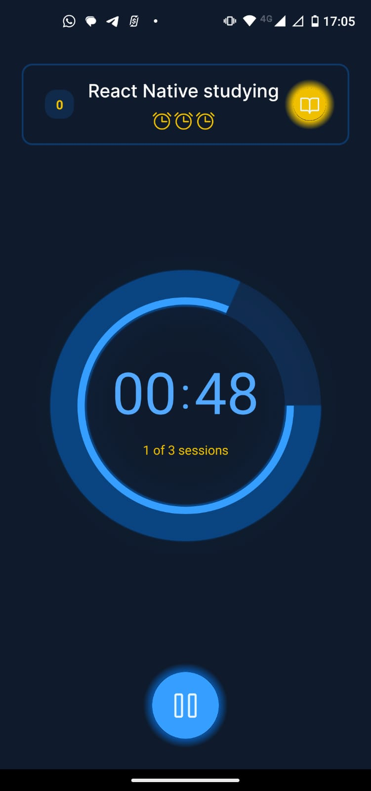
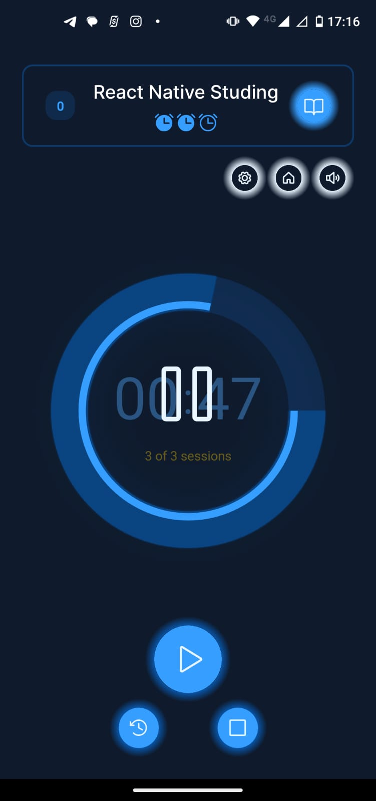
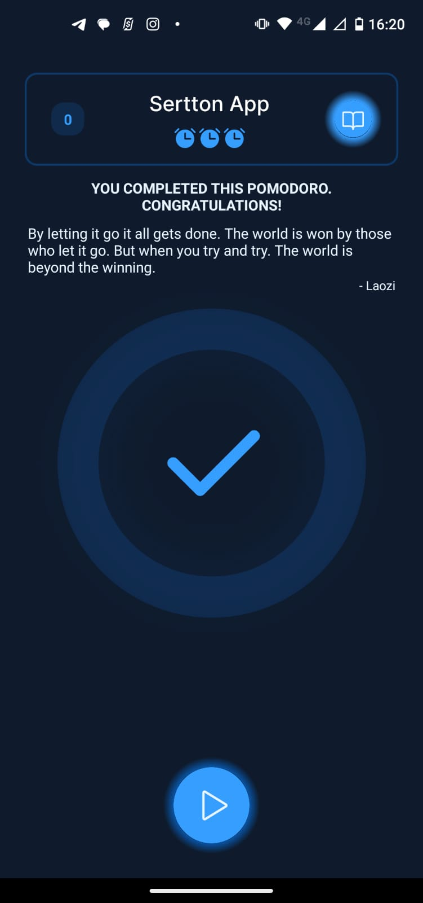
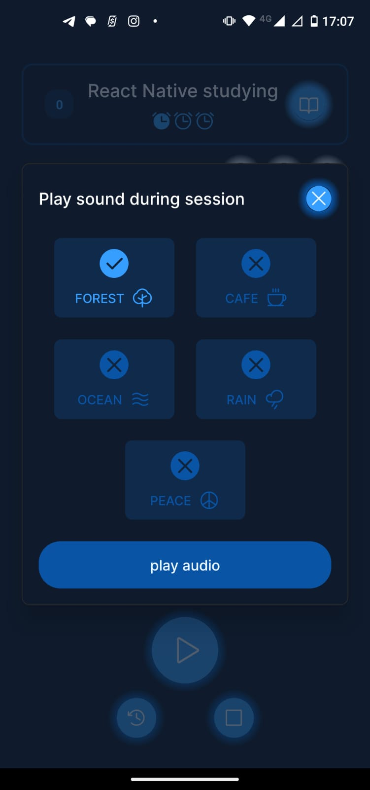
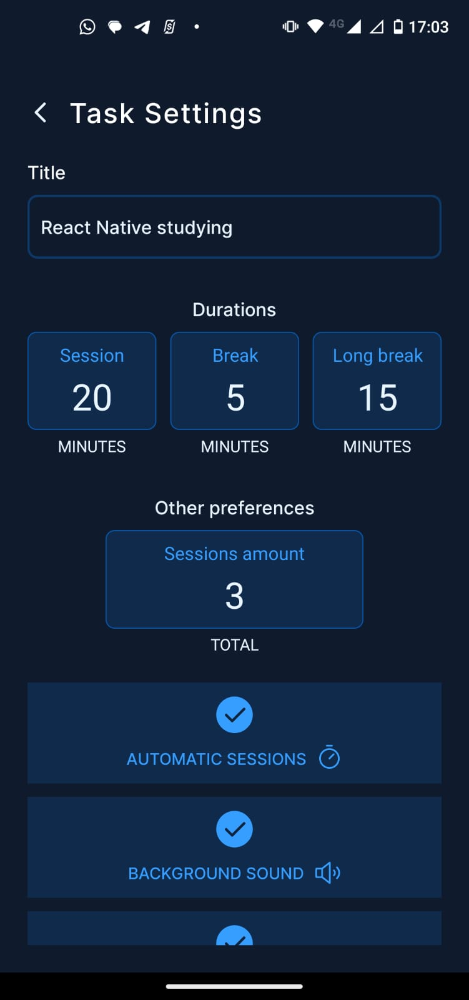

<div align="center">
  
</div>

<h1 align="center">
  Focusdoro ⌚
</h1>

<div align="center">
   <a href="https://github.com/JohnPetros">
      
   </a>
   
   <a href="https://github.com/JohnPetros/focusdoro/commits/main">
      
   </a>
  </a>
   </a>
   <a href="https://github.com/JohnPetros/focusdoro/blob/main/LICENSE.md">
      
   </a>
    
</div>
<br>

## 🖥️ About the project

Focusdoro is an app builded to help people to manage and optimize their work or study time.  

The app is built based on [Pomodoro](https://todoist.com/pt-BR/productivity-methods/pomodoro-technique) a technique in which you do focued work during certain periods of minutes organized between short breaks to promote sustained concetration and stave off mental fatigue

The goal of developing this project enhace my skills on mobile development including animations, manipulation of audio files, global state management, notification control, storage handling and use of UI libraries. 


### ⏹️ Demonstration

<table align="center">
  <tr>
    <td align="center" width="700" height="350">
      <span>Home screen <br/></span>
      
    </td>
   <td align="center" width="700" height="350">
     <span>Timer screen <br/></span>
      
    </td>
    <td align="center" width="700" height="350">
     <span>Paused timer<br/></span>
      
    </td>
  </tr>
  <tr>
    <td align="center" width="700" height="350">
      <span>Pomodoro end<br/></span>
      
    </td>
    <td align="center" width="700" height="350">
      <span>Audio setting<br/></span>
      
    </td>
    <td align="center" width="700" height="350">
      <span>Audio setting<br/></span>
      
    </td>
  </tr>
</table>

---

## ✨ Features

### ✅ Functional Features

#### Tasks listing

- [x] Should list tasks in order of creation (the most recent ones should be listed first)
- [x] Each task must be displayed in card format, showing:
    - Task name
    - The number of pomodoros the task has
    - The status of each pomodoro (completed or not completed)
    - The indication that the task itself is completed or not (when all pomodotos are completed)

#### Task creation
- [x] Should create and set a task
- [x] To each pomodoro should be set
- [x] Para cada pomodoro deve ser configurado:
    - Task name
    - Pomodoro duration (in minutes)
    - break duration (in minutes)
    - long break duration (in minutes)
    - The number of pomodoros between long breaks
  
#### Pomodoro timer

- [x] Should display a timer to count the pomodoro duration
- [x] Should be able to pause the timer
- [x] Should be able to restart the current pomodoro
- [x] Should be able to restart all pomodoros
- [x] Should indicate which pomodoro is the current one
- [x] Should count a break if the current pomodoro is completed
- [x] Should count a long break if a certain number of completed pomodoros set by the user is reached 

#### Background music

- [x] Should play a background music only when pomodoro timer is on
- [x] The user should be able to disable the background music
- [x] The user should be able to choose a music to be played out of a list of musics

---

## ⚙️ Archtecture

## 🛠️ Technologies, tools and third services

This app was development using the following technologies:

✔️ **[React Native](https://developer.mozilla.org/pt-BR/docs/Web/HTML)** to develop mobile app for both platforms [Android](https://www.android.com/intl/pt-BR_br/everyone/) and [IOS](https://www.apple.com/br/ios/ios-17/)

✔️ **[Tamagui](https://tamagui.dev/)** for styling and building of accessible components

✔️ **[Expo](https://expo.dev/)** to facilate the development processing in React Native

✔️ **[EAS](https://expo.dev/)** to generate builds of the app

✔️ **[Notifee](https://notifee.app/)** - to handle rich notifications

✔️ **[MMKV](https://github.com/mrousavy/react-native-mmkv)** - to manipulate the local storage of the user's device

✔️ **[Zustand](https://zustand-demo.pmnd.rs/)** - to manage the global state of the app

✔️ **[Phosphor icons](https://www.typescriptlang.org/)** - to display accesible and beatiful icons

> For more details about the project's dependencies like specific versions of each of them, see the [package.json file](https://github.com/JohnPetros/focusdoro/blob/main/package.json)

---

## 🚀 How to run the application?

### 🔧 Prerequisites

Before dowload the code you will need to have installed in your machine the following tools

- [Git](https://git-scm.com/) to clone this repo
- [Yarn](https://yarnpkg.com/) or [NPM](https://www.npmjs.com/) to install and execute the dependencies (I'll use NPM)

> Besides that, it is good having a code editor like [VSCode](https://code.visualstudio.com/)

> Also is it pivotal setting the enviroment variables in a file called `.env` before executing the application. See the [.env.example file](https://github.com/JohnPetros/focusdoro/blob/main/.env.example) to know which variables should be set.

### 📟 Running the application

```bash

# Clone this repository
$ git clone https://github.com/JohnPetros/focusdoro.git

# Access the app's folder
$ cd focusdoro

# Install the dependencies
$ npm install

# Generate the native code needed to run the app
$ npm build

# Run the app in the development mode
$ npm start

```

> You will need a android emulator to see the app working. However, a expo build can be run in your mobile device:

```bash
# Generaate the development expo build
$ eas build --profile development --platform android
```
> Download the build and run npm start scan the generated QR Code with your mobile device 😉.

> See [the development build documentation](https://docs.expo.dev/develop/development-builds/create-a-build/) for more details.

### 🧪 Running the tests

```bash
# run all tests
$ npm run test
```

---

## 💪 How to contribute

```bash

# fork this repository
$ git clone https://github.com/JohnPetros/focusdoro.git

# create a branch for your feature
$ git checkout -b my-feature

# commit your changes
$ git commit -m '✨ feat: My feature message'

# push your branch:
$ git push origin my-feature

```

> Your should replace 'my-feature' with the name of the feature you are making.

> You can also open an [issue](https://github.com/JohnPetros/focusdoro/issues) about some found problem, question or suggestion for the project. I will really happy to help, as well as improve this project.

---

## 📝 License

This application is under MIT license. See the [license file](LICENSE) for more details.

---

<p align="center">
  Made with 💜 by John Petros 👋🏻
</p>